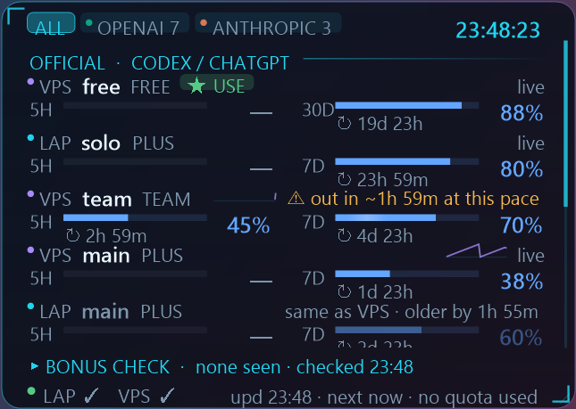

# ai-quota-hud

A sci-fi desktop widget for Windows that shows how much of your AI coding quota is left, for **every Codex / ChatGPT account, xKiro, and Claude Code**, on this PC and on a remote Linux box. Built with **Claude Code (Claude Opus 5.5)**.



> ไทย: ดูหัวข้อ [ภาษาไทย](#ภาษาไทย) ด้านล่าง · Looking for CPU/GPU monitoring? See [system-hud-widget](https://github.com/Pakapong26/system-hud-widget).

## Download

**[⬇ Latest release (prebuilt Windows zip)](https://github.com/Pakapong26/ai-quota-hud/releases/latest)**: no build needed.

- `…-standalone.zip`: just unzip and run `QuotaWidget.exe` (needs Python 3 only)
- `…-framework.zip`: tiny, needs the [.NET 8 Desktop Runtime](https://dotnet.microsoft.com/download/dotnet/8.0) + Python 3

Keep `collector.py` next to the exe. Right-click the widget for settings. Windows SmartScreen may warn because the exe is unsigned; build from source below if you prefer.

## It uses zero quota

It never calls a model. It only reads what the tools already write:

- **Codex CLI**: `~/.codex*/sessions/**/*.jsonl`, the `rate_limits` field of `token_count` events (5-hour / 7-day / 30-day windows, `used_percent`, `resets_at`).
- **Claude Code**: `~/.claude*/projects/**/*.jsonl`, the `usage` of each message (tokens in the last 5 h, 24 h, 7 d).
- **xKiro** (optional): `GET https://api.xkiro.com/v1/usage`, a meter read, not a generation, so it costs nothing.

It never opens `auth.json` or any credential file. The xKiro key stays on the machine that runs the collector; only numbers come back.

## Features

- One row per account: plan, "x% left" for each window, countdown to reset, *CREDITS 0*, *stale*, *RESET ✓ READY*
- xKiro: dollars left in the 5 h and 7 d windows, free tokens used today, wallet
- **Bonus / early reset check**: each refresh is compared with the last; if usage drops or the reset time moves earlier before the scheduled reset, it flags *EARLY RESET* with the time (kept 48 h)
- Shows 5 rows; scroll with the mouse wheel for the rest
- 8 colour themes, dark / light, glass / tinted / solid / floating, panel and whole-widget opacity
- Resize with Ctrl + wheel, by dragging the corner, or from the menu (60 to 220 %)
- **Pin to desktop** like Rainmeter's "On desktop" (stays after Win+D), Always on top, or click-through overlay
- Light animations (gliding bars, shimmer, pulse when full), can be turned off
- Plain WinForms (.NET 8) + a small Python collector, about 70 MB RAM


## Build from source

Needs the .NET 8 SDK and Python 3 on Windows 10/11.

```
dotnet publish -c Release -o publish
publish\QuotaWidget.exe
```

Right-click the widget for every option; double-click to refresh now.

### Accounts on a remote Linux box (optional)

Create `~/.vps_env` on the Windows PC:

```
export VPS_HOST=your.server
export VPS_USER=you
export VPS_KEY=~/.ssh/your_key
```

The widget runs `collector.py` there over SSH (`python3 -`, key login only, `BatchMode=yes`). Nothing is written on the server.

For xKiro put the key in `~/.config/xkiro/key` (or set `XKIRO_KEY_FILE`), and set `XKIRO_CODEX_HOMES` to the Codex homes that route through xKiro if they are not in `~/.config/xkiro/codex/*`.

## Limits

- Codex only writes rate limits when an account is used, so an idle account shows its last reading; *RESET ✓ READY* means the scheduled reset time has passed.
- Some plans report one window only (Plus reports 7 days); the missing 5 h slot reads "— not in logs" instead of a guess.
- Claude Code logs have no limit percentage, so the Anthropic line of the reset check is a manual reminder.

## Feedback and ideas

Want a feature or found a bug? Tell me either way, all ideas welcome:

- GitHub: [open an issue](https://github.com/Pakapong26/ai-quota-hud/issues)
- X (Twitter): mention or DM [@Pakapong26](https://x.com/Pakapong26)

## ภาษาไทย

วิดเจ็ตเดสก์ท็อปสำหรับ Windows ดูว่าโควต้า AI เหลือเท่าไร ครบทุกบัญชี Codex/ChatGPT, xKiro และ Claude Code ทั้งในเครื่องและบน VPS ทำด้วย **Claude Code**

- **ไม่กินโควต้า** ไม่เรียก AI อ่านแค่ไฟล์บันทึก ไม่เปิดไฟล์ล็อกอิน
- ดู % ที่เหลือของรอบ 5 ชม. / 7 วัน / 30 วัน พร้อมนับถอยหลังรีเซ็ต
- xKiro ดูเงินที่เหลือ โควต้าฟรีรายวัน และ wallet
- ตรวจจับรีเซ็ตโบนัสก่อนกำหนด
- โชว์ 5 แถว เลื่อนดูที่เหลือได้, 8 ธีม, มืด/สว่าง, ปรับความโปร่งใส, ย่อขยาย, ปักบนเดสก์ท็อปแบบ Rainmeter

**ดาวน์โหลด:** [หน้า Release ล่าสุด](https://github.com/Pakapong26/ai-quota-hud/releases/latest) ไม่ต้อง build
- ไฟล์ `standalone` แตก zip แล้วเปิด `QuotaWidget.exe` ได้เลย (ต้องมี Python 3)
- ไฟล์ `framework` ขนาดเล็ก ต้องลง .NET 8 Desktop Runtime + Python 3
- วาง `collector.py` ไว้ข้าง exe คลิกขวาที่วิดเจ็ตเพื่อตั้งค่า

Build เอง: ลง .NET 8 SDK และ Python 3 แล้วรัน `dotnet publish -c Release -o publish`

**อยากได้ฟีเจอร์อะไรหรือเจอบั๊ก** บอกได้ทั้ง [เปิด issue บน GitHub](https://github.com/Pakapong26/ai-quota-hud/issues) หรือแท็ก / DM มาที่ X [@Pakapong26](https://x.com/Pakapong26) ยินดีรับทุกไอเดียครับ

## License

MIT. Made with [Claude Code](https://claude.com/claude-code).
