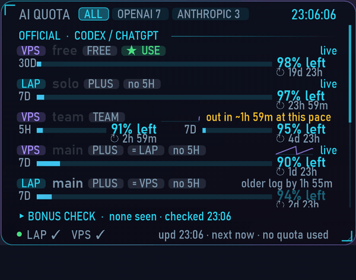
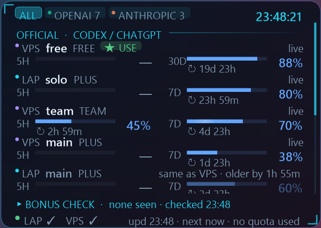
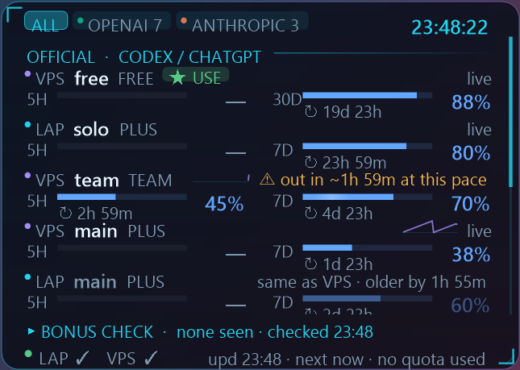
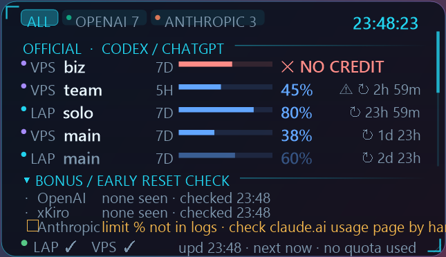
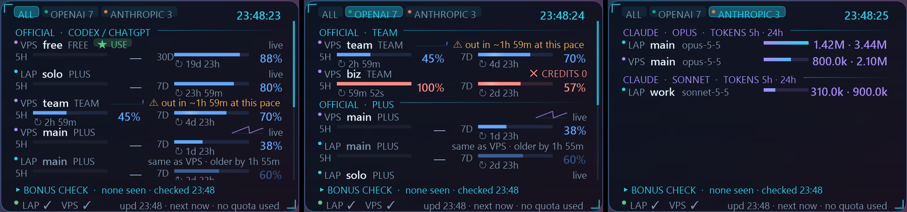
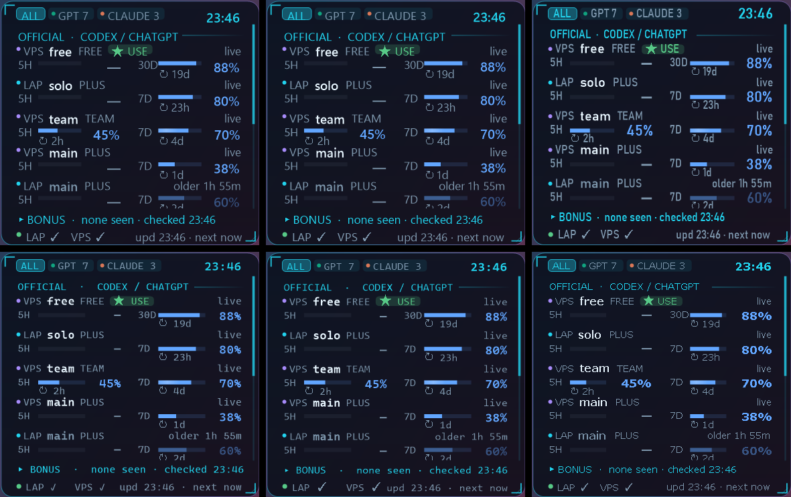
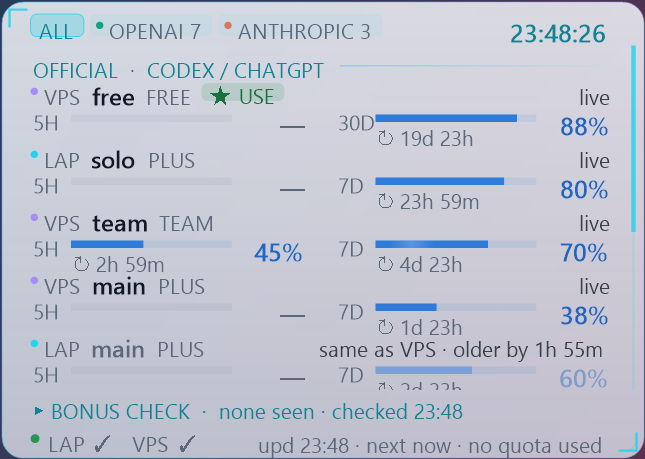

# ai-quota-hud

[](https://github.com/hashgraph-online/hol-guard) [](https://github.com/Pakapong26/ai-quota-hud/releases/latest) [](LICENSE)

A sci-fi desktop widget for Windows that shows how much of your AI coding quota is left, for **every Codex / ChatGPT account, xKiro, and Claude Code**, on this PC and on a remote Linux box. Built with **Claude Code (Claude Opus 5.5)**.



*(demo data)*

> ไทย: ดูหัวข้อ [ภาษาไทย](#ภาษาไทย) ด้านล่าง · Looking for CPU/GPU monitoring? See [system-hud-widget](https://github.com/Pakapong26/system-hud-widget).

## Download

**[⬇ Latest release (prebuilt Windows zip)](https://github.com/Pakapong26/ai-quota-hud/releases/latest)**: no build needed.

Pick an edition (same app, you can switch any time from right-click → **Edition**):

| | **Lite** | **Full** |
|---|---|---|
| ★ USE on the account with the most quota left | ✓ | ✓ |
| Provider tabs ALL / OPENAI / ANTHROPIC, grouped by plan and model | ✓ | ✓ |
| Sort by last used / soonest reset / most left / most used | ✓ | ✓ |
| Bonus check folds to one line (click to open, opens itself on an early reset) | ✓ | ✓ |
| Font picker, severity colours, readable at small sizes | ✓ | ✓ |
| Windows alerts: window reset, 90 % used, bonus reset | | ✓ |
| Compact rows, one line per account (hover for details) | | ✓ |
| 7-day usage sparkline + "out in ~X at this pace" | | ✓ |

- `…-lite-standalone.zip` / `…-full-standalone.zip`: just unzip and run `QuotaWidget.exe` (needs Python 3 only)
- `…-lite-framework.zip` / `…-full-framework.zip`: tiny, need the [.NET 8 Desktop Runtime](https://dotnet.microsoft.com/download/dotnet/8.0) + Python 3

| Lite | Full | Full, compact |
|---|---|---|
|  |  |  |

*(screenshots use demo data)*

Keep `collector.py` next to the exe. Right-click the widget for settings. Windows SmartScreen may warn because the exe is unsigned; build from source below if you prefer.

## It uses zero quota

It never calls a model. It only reads what the tools already write:

- **Codex CLI**: `~/.codex*/sessions/**/*.jsonl`, the `rate_limits` field of `token_count` events (5-hour / 7-day / 30-day windows, `used_percent`, `resets_at`).
- **Claude Code**: `~/.claude*/projects/**/*.jsonl`, the `usage` of each message (tokens in the last 5 h, 24 h, 7 d).
- **xKiro** (optional): `GET https://api.xkiro.com/v1/usage`, a meter read, not a generation, so it costs nothing.

It never opens `auth.json` or any credential file. The xKiro key stays on the machine that runs the collector; only numbers come back.

## Features

- One row per account, the same two columns on every row (5H | 7D/30D): a bar of what is **left**, the % right-aligned, the countdown under the bar; status on the right (✓ READY, ✕ CREDITS 0, ⏱ stale, ⚠ out in ~X)
- **Severity colours** independent of the theme: blue fine, amber ≤30 % left, red ≤10 %, green ready; every status also has a symbol, so nothing relies on colour alone
- xKiro: dollars left in the 5 h and 7 d windows, free tokens used today, wallet
- **Provider tabs** in the title bar: **ALL · OPENAI · ANTHROPIC** (plus any new provider the collector finds). OPENAI groups by plan (TEAM / PLUS / FREE…), then xKiro, then other / no-login homes; ANTHROPIC groups Claude by model (OPUS / SONNET / HAIKU), most used first

  
- **★ USE** marks the account with the most quota left; sort by last used, soonest reset, most left or most used
- Plans that only report a 7-day window show a quiet "—" in the 5H column, so rows stay aligned
- **Bonus / early reset check**: folds to one line (click its header) and opens itself when a new one shows up; each refresh is compared with the last; if usage drops or the reset time moves earlier before the scheduled reset, it flags *EARLY RESET* with the time (kept 48 h)
- **Same account on LAP and VPS**: rows stay separate (each with its own countdown); the one with the older log sits underneath, dimmed, with "same as VPS · older by …" (hover any row for twin, plan and model details)
- Shows 5 rows; scroll with the mouse wheel for the rest
- 8 colour themes, dark / light, glass / tinted / solid / floating, panel and whole-widget opacity
- **Font picker** (right-click → Font): Segoe UI (GitHub style, default), Segoe UI Variable, Bahnschrift, Cascadia Mono, Consolas, Arial, Verdana, Inter if installed; only fonts on your PC are listed

  
- Resize with Ctrl + wheel, by dragging the corner, or from the menu (60 to 220 %); below ~80 % the text keeps a readable size and the layout narrows, with short labels (GPT / CLAUDE, 2h)
- **Pin to desktop** like Rainmeter's "On desktop" (stays after Win+D), Always on top, or click-through overlay
- Light animations (gliding bars, shimmer, pulse when full), can be turned off
- Plain WinForms (.NET 8) + a small Python collector, about 70 MB RAM



## Build from source

Needs the .NET 8 SDK and Python 3 on Windows 10/11.

```
dotnet publish -c Release -o publish
publish\QuotaWidget.exe
```

Right-click the widget for every option; double-click to refresh now.

### Accounts on a remote Linux box (optional)

Create `~/.vps_env` on the Windows PC:

```
export VPS_HOST=your.server
export VPS_USER=you
export VPS_KEY=~/.ssh/your_key
```

The widget runs `collector.py` there over SSH (`python3 -`, key login only, `BatchMode=yes`). Nothing is written on the server.

For xKiro put the key in `~/.config/xkiro/key` (or set `XKIRO_KEY_FILE`), and set `XKIRO_CODEX_HOMES` to the Codex homes that route through xKiro if they are not in `~/.config/xkiro/codex/*`.

## Limits

- Codex only writes rate limits when an account is used, so an idle account shows its last reading; *RESET ✓ READY* means the scheduled reset time has passed.
- Some plans report one window only (Plus reports 7 days); the missing 5H column reads "—" instead of a guess.
- Claude Code logs have no limit percentage, so the Anthropic line of the reset check is a manual reminder.

See [CHANGELOG.md](CHANGELOG.md) for what changed in each release, and [SECURITY.md](SECURITY.md) for what the widget reads and how to report a problem.

## Feedback and ideas

Want a feature or found a bug? Tell me either way, all ideas welcome:

- GitHub: [open an issue](https://github.com/Pakapong26/ai-quota-hud/issues)
- X (Twitter): mention or DM [@Pakapong26](https://x.com/Pakapong26)

## ภาษาไทย

วิดเจ็ตเดสก์ท็อปสำหรับ Windows ดูว่าโควต้า AI เหลือเท่าไร ครบทุกบัญชี Codex/ChatGPT, xKiro และ Claude Code ทั้งในเครื่องและบน VPS ทำด้วย **Claude Code**

- **ไม่กินโควต้า** ไม่เรียก AI อ่านแค่ไฟล์บันทึก ไม่เปิดไฟล์ล็อกอิน
- ดู % ที่เหลือของรอบ 5 ชม. / 7 วัน / 30 วัน พร้อมนับถอยหลังรีเซ็ต
- xKiro ดูเงินที่เหลือ โควต้าฟรีรายวัน และ wallet
- ตรวจจับรีเซ็ตโบนัสก่อนกำหนด (ส่วนนี้พับเหลือบรรทัดเดียวได้ กางเองเมื่อเจอ)
- ดีไซน์ v1.3: สีบอกระดับความเสี่ยงไม่ขึ้นกับธีม (น้ำเงินปกติ / เหลืองเหลือ ≤30% / แดงเหลือ ≤10% / เขียวพร้อมใช้) มีสัญลักษณ์กำกับทุกสถานะ แถบแสดงส่วนที่เหลือ ทุกแถวมี 2 คอลัมน์ตรงกัน (5H | 7D)
- เลือกฟอนต์ได้ (คลิกขวา → Font) ค่าเริ่มต้น Segoe UI แบบ GitHub และย่อเล็กแล้วตัวหนังสือยังอ่านได้
- แท็บบนหัววิดเจ็ต **ALL / OPENAI / ANTHROPIC** คลิกเลือกได้ OPENAI แบ่งกลุ่มตามแพ็กเกจ (TEAM / PLUS / FREE) + xKiro + อื่นๆ ส่วน ANTHROPIC แบ่งตามโมเดล (OPUS / SONNET / HAIKU) เรียงจากใช้มากไปน้อย ถ้ามีเจ้าใหม่จะขึ้นแท็บเพิ่มเอง
- มี 2 รุ่นให้เลือก สลับได้ในเมนูคลิกขวา → Edition
  - **Lite**: ★ USE บอกบัญชีที่ควรใช้, เรียงตามรีเซ็ตก่อน / เหลือมากสุด / ใช้มากสุด, ป้าย no 5H แทนช่องว่าง
  - **Full**: ทุกอย่างใน Lite + แจ้งเตือน Windows (รีเซ็ตแล้ว / ใช้ถึง 90% / bonus reset), แถวแบบย่อ (ชี้เมาส์ดูรายละเอียด), กราฟใช้งาน 7 วัน และบอกว่าจะหมดในอีกกี่ชั่วโมงถ้าใช้ในอัตรานี้
- บัญชีเดียวกันที่เห็นทั้งในเครื่องและบน VPS จะมีป้าย `= LAP` / `= VPS` และแถวที่ log เก่ากว่าจะจางลงพร้อมบอกว่าเก่ากว่ากี่นาที
- โชว์ 5 แถว เลื่อนดูที่เหลือได้, 8 ธีม, มืด/สว่าง, ปรับความโปร่งใส, ย่อขยาย, ปักบนเดสก์ท็อปแบบ Rainmeter

**ดาวน์โหลด:** [หน้า Release ล่าสุด](https://github.com/Pakapong26/ai-quota-hud/releases/latest) ไม่ต้อง build
- ไฟล์ `standalone` แตก zip แล้วเปิด `QuotaWidget.exe` ได้เลย (ต้องมี Python 3)
- ไฟล์ `framework` ขนาดเล็ก ต้องลง .NET 8 Desktop Runtime + Python 3
- วาง `collector.py` ไว้ข้าง exe คลิกขวาที่วิดเจ็ตเพื่อตั้งค่า

Build เอง: ลง .NET 8 SDK และ Python 3 แล้วรัน `dotnet publish -c Release -o publish`

**อยากได้ฟีเจอร์อะไรหรือเจอบั๊ก** บอกได้ทั้ง [เปิด issue บน GitHub](https://github.com/Pakapong26/ai-quota-hud/issues) หรือแท็ก / DM มาที่ X [@Pakapong26](https://x.com/Pakapong26) ยินดีรับทุกไอเดียครับ

## License

MIT. Made with [Claude Code](https://claude.com/claude-code).
