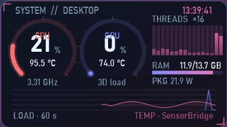

# desktop-ai-hud

Two small sci-fi desktop widgets for Windows, built with **Claude Code (Claude Opus 5.5)**:

| | |
|---|---|
|  |  |
| **HUD Widget**: CPU / GPU load and temperature, per-thread load, RAM, CPU package power, 60 s graph | **AI Quota Widget**: Codex / ChatGPT rate-limit windows, xKiro spend, Claude Code token use, for every account on this PC and on a remote Linux box |

Both are plain WinForms (.NET 8), drawn with GDI+ on a per-pixel-alpha window. No Electron, no browser, about 70 MB RAM.

> ไทย: ดูหัวข้อ [ภาษาไทย](#ภาษาไทย) ด้านล่าง

## Why the quota widget uses no quota

It never calls a model. It only reads the logs that the tools already write:

- **Codex CLI**: `~/.codex*/sessions/**/*.jsonl`, the `rate_limits` field of `token_count` events (5-hour / 7-day / 30-day windows, `used_percent`, `resets_at`).
- **Claude Code**: `~/.claude*/projects/**/*.jsonl`, the `usage` of each message (tokens in the last 5 h, 24 h, 7 d).
- **xKiro** (optional): `GET https://api.xkiro.com/v1/usage`, a meter read, not a generation, so it costs nothing.

It never opens `auth.json` or any credential file, and the xKiro key stays on the machine that runs the collector; only numbers come back.

## Features

- 8 colour themes, dark / light, glass / tinted / solid / floating backgrounds, panel and whole-widget opacity
- Resize: Ctrl + mouse wheel, drag the bottom-right corner, or the Size menu (60 to 220 %)
- **Pin to desktop**: sits on the wallpaper under every window and stays after Win+D, like Rainmeter's "On desktop"; or Always on top; or a click-through overlay (undo from the tray icon)
- Animations: bars glide to new values, a shimmer runs along them, full bars pulse; can be turned off
- Quota widget: shows 5 rows, scroll with the mouse wheel for the rest; "x% left" and a reset countdown per window
- **Bonus / early reset check**: each refresh is compared with the last; if usage drops or the reset time moves earlier before the scheduled reset, the widget flags *EARLY RESET* with the time (kept 48 h)
- Settings are saved in `%APPDATA%\<widget>\settings.txt`; right-click for every option

## Build

Needs the .NET 8 SDK on Windows 10/11.

```
cd hud-widget
dotnet publish -c Release -o publish
publish\HudWidget.exe
```

```
cd quota-widget
dotnet publish -c Release -o publish
publish\QuotaWidget.exe
```

### HUD temperatures (optional)

Windows does not expose CPU/GPU temperatures without a driver. Either run [LibreHardwareMonitor](https://github.com/LibreHardwareMonitor/LibreHardwareMonitor) with its web server on port 8085, or build `hud-widget/bridge/SensorBridge.cs` next to `LibreHardwareMonitorLib.dll` and run it as admin; it writes `%ProgramData%\HudWidget\sensors.txt` once a second. Without either, the HUD still shows load, RAM and the graph.

Set `HUD_LABEL` to change the title (it shows the computer name by default).

### Quota widget: a remote Linux box (optional)

To include accounts on a server, create `~/.vps_env` on the Windows PC:

```
export VPS_HOST=your.server
export VPS_USER=you
export VPS_KEY=~/.ssh/your_key
```

The widget runs `collector.py` there over SSH (`python3 -`, key login only, `BatchMode=yes`). Python 3 is needed on both sides. Nothing is written on the server.

For xKiro, put the key in `~/.config/xkiro/key` (or set `XKIRO_KEY_FILE`), and point `XKIRO_CODEX_HOMES` at the Codex homes that route through xKiro if they are not in `~/.config/xkiro/codex/*`.

## Limits

- Codex only writes rate limits when an account is used, so an idle account shows its last reading with a *stale* tag; *RESET ✓ READY* means the scheduled reset time has passed.
- Some plans only report one window (for example Plus reports 7 days); the missing 5-hour slot shows "— not in logs" instead of a guess.
- Claude Code logs have no limit percentage, so the Anthropic line of the reset check is a manual reminder.

## ภาษาไทย

วิดเจ็ตเดสก์ท็อปสไตล์ไซไฟ 2 ตัวสำหรับ Windows ทำด้วย **Claude Code (Claude Opus 5.5)**

- **HUD Widget**: ดูโหลดและอุณหภูมิ CPU/GPU, โหลดรายเธรด, RAM, กำลังไฟ CPU, กราฟ 60 วินาที
- **AI Quota Widget**: ดูลิมิตของ Codex/ChatGPT (5 ชม. / 7 วัน / 30 วัน) ยอดใช้ xKiro และ token ของ Claude Code ทุกบัญชี ทั้งในเครื่องและบนเซิร์ฟเวอร์

**ไม่กินโควต้า** เพราะไม่เรียก AI เลย อ่านแค่ไฟล์บันทึกที่โปรแกรมเขียนไว้อยู่แล้ว และไม่เปิดไฟล์ล็อกอิน

ลูกเล่น: 8 ธีมสี, โหมดมืด/สว่าง, ปรับความโปร่งใส, ย่อขยายด้วย Ctrl+ลูกกลิ้งหรือลากมุม, ปักไว้บนเดสก์ท็อปแบบ Rainmeter, เลื่อนดูรายการทีละ 5 แถว, ตรวจจับการรีเซ็ตโบนัสก่อนกำหนด

วิธีติดตั้ง: ติดตั้ง .NET 8 SDK แล้วรัน `dotnet publish -c Release -o publish` ในโฟลเดอร์ของแต่ละวิดเจ็ต คลิกขวาที่วิดเจ็ตเพื่อตั้งค่าทุกอย่าง

## License

MIT. Use it, change it, share it.

Made with [Claude Code](https://claude.com/claude-code).
